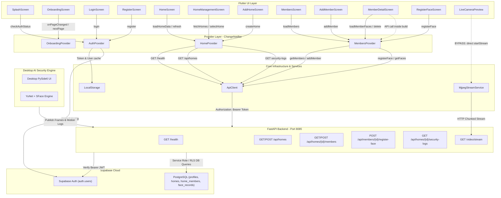

# OTTO Smart-Home Security — Complete Repository Audit & Flutter Provider Architecture Report

**Document Date:** October 10, 2026  
**Auditor:** Antigravity AI (Pair Programming Assistant)  
**Target Repository:** `D:\smart_home_security`  
**Primary Subsystem:** Flutter Mobile Client (`D:\smart_home_security\mobile`)  
**Backend:** FastAPI (Port 8085)  
**Database & Auth:** Supabase PostgreSQL & Supabase Auth  
**Desktop AI Security:** Python, OpenCV, SFace/YuNet ONNX, PySide6  
**Audit Constraint Status:** **AUDIT ONLY — NO SOURCE CODE, CONFIGURATION, DATABASE, OR RUNTIME STATE WAS MODIFIED.**

---

## 1. Executive Summary

A comprehensive architectural and static code audit was conducted on the OTTO Smart-Home Security codebase located at `D:\smart_home_security`. The project consists of three interconnected systems:
1. **A cross-platform Flutter mobile client** (`mobile/`) configured for physical Android phone testing, running on the Emerald Ink (`#064E3B`) and Champagne (`#F8E7C9`) design system.
2. **A FastAPI REST & MJPEG streaming backend** (`app/api/`) providing authentication verification, entity persistence, video frame publishing, and AI security event logging.
3. **A PySide6 desktop security dashboard with computer vision AI** (`app/ui/`, `app/security/`, `app/camera/`) running YuNet face detection and SFace 128-dimensional embedding extraction.

### Core Metrics Summary

| Metric Area | Count | Details |
| :--- | :--- | :--- |
| **Total Dart Source Files (`mobile/lib`)** | **29** files | 4 re-export proxies, 4 core widgets, 3 providers, 6 domain models, 12 feature screens/widgets |
| **Mobile Test Files (`mobile/test`)** | **9** files | Unit & widget tests covering providers, HTTP client, and screens |
| **Backend Python Files (`app/`)** | **33** files | API routes, repositories, services, security AI, UI, config |
| **Backend Test Files (`tests/`)** | **11** files | 53 unit/integration tests in Pytest suite |
| **Supabase SQL Schema Files** | **1** file | `supabase/schema.sql` (11,274 bytes) defining 8 core tables, RLS policies, triggers |
| **Provider Compliance Rating** | **78%** | State is predominantly managed via Provider, but 4 key architectural gaps exist |

### High-Priority Architectural Highlights
- **State Management:** The app utilizes the `provider: ^6.1.2` package. Core app state (`AuthProvider`, `HomeProvider`, `MembersProvider`, `OnboardingProvider`) is registered via `MultiProvider` at the root of `SmartHomeApp`.
- **Identified Deficiencies:**
  - `LiveCameraPreview` bypasses Provider entirely, instantiating the singleton `MjpegStreamService` directly inside `build()` and listening via `ValueListenableBuilder` / `StreamBuilder`.
  - `MemberDetailScreen` schedules an API call (`loadMemberFaces`) directly in its `build()` method via `WidgetsBinding.addPostFrameCallback`, creating redundant frame callbacks upon re-rendering.
  - `OnboardingProvider` takes a `BuildContext` parameter in `completeOnboarding(context, targetRoute: ...)` and invokes `Navigator.of(context)` directly, violating clean separation between state management and UI navigation.
  - Redundant re-export bridge files exist in `lib/features/auth/provider/auth_provider.dart`, `lib/features/home/provider/home_provider.dart`, and feature root folders.

---

## 2. Exact Complete Project Folder Structure

### Excluded Directories
The following generated, build, and dependency caches were excluded from tree traversal:
- `.git/` (VCS metadata)
- `.venv/` (Python virtual environment)
- `__pycache__/` (Python compiled bytecode across all subdirectories)
- `mobile/.dart_tool/` (Dart build daemon & package resolution cache)
- `mobile/build/` (Flutter compilation artifacts)
- `mobile/.idea/`, `mobile/*.iml` (IDE workspace configurations)

### Complete Verified File Tree & Absolute Paths

```
D:\smart_home_security
│   .env                                    [D:\smart_home_security\.env]
│   .env.example                            [D:\smart_home_security\.env.example]
│   .gitignore                              [D:\smart_home_security\.gitignore]
│   PROJECT_ARCHITECTURE_AUDIT.md           [D:\smart_home_security\PROJECT_ARCHITECTURE_AUDIT.md]
│   README.md                               [D:\smart_home_security\README.md]
│   requirements.txt                        [D:\smart_home_security\requirements.txt]
│   run.py                                  [D:\smart_home_security\run.py]
│   skills-lock.json                        [D:\smart_home_security\skills-lock.json]
│
├───app
│   │   main.py                             [D:\smart_home_security\app\main.py]
│   │   __init__.py                         [D:\smart_home_security\app\__init__.py]
│   │
│   ├───api
│   │   │   dependencies.py                 [D:\smart_home_security\app\api\dependencies.py]
│   │   │   main.py                         [D:\smart_home_security\app\api\main.py]
│   │   │   __init__.py                     [D:\smart_home_security\app\api\__init__.py]
│   │   │
│   │   └───routes
│   │           alerts.py                   [D:\smart_home_security\app\api\routes\alerts.py]
│   │           auth.py                     [D:\smart_home_security\app\api\routes\auth.py]
│   │           devices.py                  [D:\smart_home_security\app\api\routes\devices.py]
│   │           faces.py                    [D:\smart_home_security\app\api\routes\faces.py]
│   │           homes.py                    [D:\smart_home_security\app\api\routes\homes.py]
│   │           members.py                  [D:\smart_home_security\app\api\routes\members.py]
│   │           security_logs.py            [D:\smart_home_security\app\api\routes\security_logs.py]
│   │           video.py                    [D:\smart_home_security\app\api\routes\video.py]
│   │           __init__.py                 [D:\smart_home_security\app\api\routes\__init__.py]
│   │
│   ├───camera
│   │       camera_service.py               [D:\smart_home_security\app\camera\camera_service.py]
│   │       __init__.py                     [D:\smart_home_security\app\camera\__init__.py]
│   │
│   ├───config
│   │       backend_settings.py             [D:\smart_home_security\app\config\backend_settings.py]
│   │       settings.py                     [D:\smart_home_security\app\config\settings.py]
│   │       __init__.py                     [D:\smart_home_security\app\config\__init__.py]
│   │
│   ├───database
│   │       supabase_client.py              [D:\smart_home_security\app\database\supabase_client.py]
│   │       __init__.py                     [D:\smart_home_security\app\database\__init__.py]
│   │
│   ├───models
│   │       alert.py                        [D:\smart_home_security\app\models\alert.py]
│   │       device.py                       [D:\smart_home_security\app\models\device.py]
│   │       face.py                         [D:\smart_home_security\app\models\face.py]
│   │       home.py                         [D:\smart_home_security\app\models\home.py]
│   │       member.py                       [D:\smart_home_security\app\models\member.py]
│   │       security_log.py                 [D:\smart_home_security\app\models\security_log.py]
│   │       user.py                         [D:\smart_home_security\app\models\user.py]
│   │       __init__.py                     [D:\smart_home_security\app\models\__init__.py]
│   │
│   ├───repositories
│   │       alert_repository.py             [D:\smart_home_security\app\repositories\alert_repository.py]
│   │       device_repository.py            [D:\smart_home_security\app\repositories\device_repository.py]
│   │       face_repository.py              [D:\smart_home_security\app\repositories\face_repository.py]
│   │       home_repository.py              [D:\smart_home_security\app\repositories\home_repository.py]
│   │       member_repository.py            [D:\smart_home_security\app\repositories\member_repository.py]
│   │       security_log_repository.py      [D:\smart_home_security\app\repositories\security_log_repository.py]
│   │       __init__.py                     [D:\smart_home_security\app\repositories\__init__.py]
│   │
│   ├───security
│   │       face_database.py                [D:\smart_home_security\app\security\face_database.py]
│   │       face_detection_service.py       [D:\smart_home_security\app\security\face_detection_service.py]
│   │       face_embedding_service.py       [D:\smart_home_security\app\security\face_embedding_service.py]
│   │       face_recognition_service.py     [D:\smart_home_security\app\security\face_recognition_service.py]
│   │       motion_detection_service.py     [D:\smart_home_security\app\security\motion_detection_service.py]
│   │       security_event_service.py       [D:\smart_home_security\app\security\security_event_service.py]
│   │       security_service.py             [D:\smart_home_security\app\security\security_service.py]
│   │       __init__.py                     [D:\smart_home_security\app\security\__init__.py]
│   │
│   ├───services
│   │       api_client.py                   [D:\smart_home_security\app\services\api_client.py]
│   │       auth_service.py                 [D:\smart_home_security\app\services\auth_service.py]
│   │       backend_store.py                [D:\smart_home_security\app\services\backend_store.py]
│   │       __init__.py                     [D:\smart_home_security\app\services\__init__.py]
│   │
│   ├───streaming
│   │       frame_manager.py                [D:\smart_home_security\app\streaming\frame_manager.py]
│   │       frame_publisher.py              [D:\smart_home_security\app\streaming\frame_publisher.py]
│   │       mjpeg_stream.py                 [D:\smart_home_security\app\streaming\mjpeg_stream.py]
│   │       __init__.py                     [D:\smart_home_security\app\streaming\__init__.py]
│   │
│   └───ui
│           camera_worker.py                [D:\smart_home_security\app\ui\camera_worker.py]
│           main_window.py                  [D:\smart_home_security\app\ui\main_window.py]
│           registration_dialog.py          [D:\smart_home_security\app\ui\registration_dialog.py]
│           styles.py                       [D:\smart_home_security\app\ui\styles.py]
│           __init__.py                     [D:\smart_home_security\app\ui\__init__.py]
│
├───data
│   ├───face_database                       [D:\smart_home_security\data\face_database]
│   └───faces                               [D:\smart_home_security\data\faces]
│
├───models
│       deploy.prototxt                     [D:\smart_home_security\models\deploy.prototxt]
│       face_detection_yunet_2023mar.onnx   [D:\smart_home_security\models\face_detection_yunet_2023mar.onnx]
│       face_recognition_sface_2021dec.onnx [D:\smart_home_security\models\face_recognition_sface_2021dec.onnx]
│       res10_300x300_ssd_iter_140000.caffemodel [D:\smart_home_security\models\res10_300x300_ssd_iter_140000.caffemodel]
│
├───supabase
│       schema.sql                          [D:\smart_home_security\supabase\schema.sql]
│
├───tests
│       test_backend.py                     [D:\smart_home_security\tests\test_backend.py]
│       test_face_detection.py              [D:\smart_home_security\tests\test_face_detection.py]
│       test_security_authorization.py      [D:\smart_home_security\tests\test_security_authorization.py]
│       test_step11_5_mobile_face.py        [D:\smart_home_security\tests\test_step11_5_mobile_face.py]
│       test_step11_repositories.py         [D:\smart_home_security\tests\test_step11_repositories.py]
│       test_step5.py                       [D:\smart_home_security\tests\test_step5.py]
│       test_step5_e2e.py                   [D:\smart_home_security\tests\test_step5_e2e.py]
│       test_step7.py                       [D:\smart_home_security\tests\test_step7.py]
│       test_step8.py                       [D:\smart_home_security\tests\test_step8.py]
│       test_ui.py                          [D:\smart_home_security\tests\test_ui.py]
│       __init__.py                         [D:\smart_home_security\tests\__init__.py]
│
└───mobile
    │   analysis_options.yaml               [D:\smart_home_security\mobile\analysis_options.yaml]
    │   pubspec.yaml                        [D:\smart_home_security\mobile\pubspec.yaml]
    │   pubspec.lock                        [D:\smart_home_security\mobile\pubspec.lock]
    │   README.md                           [D:\smart_home_security\mobile\README.md]
    │
    ├───assets
    │   └───images
    │           splash.png                  [D:\smart_home_security\mobile\assets\images\splash.png]
    │
    ├───lib
    │   │   main.dart                       [D:\smart_home_security\mobile\lib\main.dart]
    │   │
    │   ├───app
    │   │   │   app.dart                    [D:\smart_home_security\mobile\lib\app\app.dart]
    │   │   │
    │   │   ├───routes
    │   │   │       app_routes.dart         [D:\smart_home_security\mobile\lib\app\routes\app_routes.dart]
    │   │   │
    │   │   └───theme
    │   │           app_colors.dart         [D:\smart_home_security\mobile\lib\app\theme\app_colors.dart]
    │   │           app_spacing.dart        [D:\smart_home_security\mobile\lib\app\theme\app_spacing.dart]
    │   │           app_text_styles.dart    [D:\smart_home_security\mobile\lib\app\theme\app_text_styles.dart]
    │   │           app_theme.dart          [D:\smart_home_security\mobile\lib\app\theme\app_theme.dart]
    │   │
    │   ├───core
    │   │   ├───config
    │   │   │       api_config.dart         [D:\smart_home_security\mobile\lib\core\config\api_config.dart]
    │   │   │
    │   │   ├───network
    │   │   │       api_client.dart         [D:\smart_home_security\mobile\lib\core\network\api_client.dart]
    │   │   │       api_exception.dart      [D:\smart_home_security\mobile\lib\core\network\api_exception.dart]
    │   │   │       mjpeg_stream_service.dart [D:\smart_home_security\mobile\lib\core\network\mjpeg_stream_service.dart]
    │   │   │
    │   │   ├───storage
    │   │   │       local_storage.dart      [D:\smart_home_security\mobile\lib\core\storage\local_storage.dart]
    │   │   │
    │   │   └───widgets
    │   │           app_button.dart         [D:\smart_home_security\mobile\lib\core\widgets\app_button.dart]
    │   │           app_text_field.dart     [D:\smart_home_security\mobile\lib\core\widgets\app_text_field.dart]
    │   │           loading_widget.dart     [D:\smart_home_security\mobile\lib\core\widgets\loading_widget.dart]
    │   │           subtle_blur_card.dart   [D:\smart_home_security\mobile\lib\core\widgets\subtle_blur_card.dart]
    │   │
    │   ├───features
    │   │   ├───auth
    │   │   │   │   login_screen.dart       [D:\smart_home_security\mobile\lib\features\auth\login_screen.dart] *(proxy)*
    │   │   │   │   register_screen.dart    [D:\smart_home_security\mobile\lib\features\auth\register_screen.dart] *(proxy)*
    │   │   │   │
    │   │   │   ├───presentation
    │   │   │   │       login_screen.dart   [D:\smart_home_security\mobile\lib\features\auth\presentation\login_screen.dart]
    │   │   │   │       register_screen.dart [D:\smart_home_security\mobile\lib\features\auth\presentation\register_screen.dart]
    │   │   │   │
    │   │   │   ├───provider
    │   │   │   │       auth_provider.dart  [D:\smart_home_security\mobile\lib\features\auth\provider\auth_provider.dart] *(proxy)*
    │   │   │   │
    │   │   │   └───widgets
    │   │   │           auth_button.dart    [D:\smart_home_security\mobile\lib\features\auth\widgets\auth_button.dart]
    │   │   │           auth_header.dart    [D:\smart_home_security\mobile\lib\features\auth\widgets\auth_header.dart]
    │   │   │           auth_text_field.dart [D:\smart_home_security\mobile\lib\features\auth\widgets\auth_text_field.dart]
    │   │   │
    │   │   ├───home
    │   │   │   │   home_placeholder_screen.dart [D:\smart_home_security\mobile\lib\features\home\home_placeholder_screen.dart] *(proxy)*
    │   │   │   │
    │   │   │   ├───presentation
    │   │   │   │       add_home_screen.dart [D:\smart_home_security\mobile\lib\features\home\presentation\add_home_screen.dart]
    │   │   │   │       home_management_screen.dart [D:\smart_home_security\mobile\lib\features\home\presentation\home_management_screen.dart]
    │   │   │   │       home_screen.dart    [D:\smart_home_security\mobile\lib\features\home\presentation\home_screen.dart]
    │   │   │   │
    │   │   │   ├───provider
    │   │   │   │       home_provider.dart  [D:\smart_home_security\mobile\lib\features\home\provider\home_provider.dart] *(proxy)*
    │   │   │   │
    │   │   │   └───widgets
    │   │   │           activity_item.dart  [D:\smart_home_security\mobile\lib\features\home\widgets\activity_item.dart]
    │   │   │           backend_connection_card.dart [D:\smart_home_security\mobile\lib\features\home\widgets\backend_connection_card.dart]
    │   │   │           home_header.dart    [D:\smart_home_security\mobile\lib\features\home\widgets\home_header.dart]
    │   │   │           live_camera_preview.dart [D:\smart_home_security\mobile\lib\features\home\widgets\live_camera_preview.dart]
    │   │   │           quick_actions_grid.dart [D:\smart_home_security\mobile\lib\features\home\widgets\quick_actions_grid.dart]
    │   │   │           recent_activity.dart [D:\smart_home_security\mobile\lib\features\home\widgets\recent_activity.dart]
    │   │   │           security_status_card.dart [D:\smart_home_security\mobile\lib\features\home\widgets\security_status_card.dart]
    │   │   │
    │   │   ├───members
    │   │   │   ├───presentation
    │   │   │   │       add_member_screen.dart [D:\smart_home_security\mobile\lib\features\members\presentation\add_member_screen.dart]
    │   │   │   │       member_detail_screen.dart [D:\smart_home_security\mobile\lib\features\members\presentation\member_detail_screen.dart]
    │   │   │   │       members_screen.dart [D:\smart_home_security\mobile\lib\features\members\presentation\members_screen.dart]
    │   │   │   │       register_face_screen.dart [D:\smart_home_security\mobile\lib\features\members\presentation\register_face_screen.dart]
    │   │   │   │
    │   │   │   ├───provider
    │   │   │   │       members_provider.dart [D:\smart_home_security\mobile\lib\features\members\provider\members_provider.dart]
    │   │   │   │
    │   │   │   └───widgets
    │   │   │           member_action_button.dart [D:\smart_home_security\mobile\lib\features\members\widgets\member_action_button.dart]
    │   │   │           member_avatar.dart  [D:\smart_home_security\mobile\lib\features\members\widgets\member_avatar.dart]
    │   │   │           member_empty_state.dart [D:\smart_home_security\mobile\lib\features\members\widgets\member_empty_state.dart]
    │   │   │           member_list_item.dart [D:\smart_home_security\mobile\lib\features\members\widgets\member_list_item.dart]
    │   │   │
    │   │   ├───onboarding
    │   │   │   ├───presentation
    │   │   │   │       onboarding_screen.dart [D:\smart_home_security\mobile\lib\features\onboarding\presentation\onboarding_screen.dart]
    │   │   │   │
    │   │   │   └───widgets
    │   │   │           animated_get_started_button.dart [D:\smart_home_security\mobile\lib\features\onboarding\widgets\animated_get_started_button.dart]
    │   │   │
    │   │   └───splash
    │   │       │   splash_screen.dart      [D:\smart_home_security\mobile\lib\features\splash\splash_screen.dart] *(proxy)*
    │   │       │
    │   │       └───presentation
    │   │               splash_screen.dart  [D:\smart_home_security\mobile\lib\features\splash\presentation\splash_screen.dart]
    │   │
    │   ├───models
    │   │       api_response_model.dart     [D:\smart_home_security\mobile\lib\models\api_response_model.dart]
    │   │       face_record_model.dart      [D:\smart_home_security\mobile\lib\models\face_record_model.dart]
    │   │       home_model.dart             [D:\smart_home_security\mobile\lib\models\home_model.dart]
    │   │       member_model.dart           [D:\smart_home_security\mobile\lib\models\member_model.dart]
    │   │       security_log_model.dart     [D:\smart_home_security\mobile\lib\models\security_log_model.dart]
    │   │       user_model.dart             [D:\smart_home_security\mobile\lib\models\user_model.dart]
    │   │
    │   └───providers
    │           auth_provider.dart          [D:\smart_home_security\mobile\lib\providers\auth_provider.dart]
    │           home_provider.dart          [D:\smart_home_security\mobile\lib\providers\home_provider.dart]
    │           onboarding_provider.dart    [D:\smart_home_security\mobile\lib\providers\onboarding_provider.dart]
    │
    └───test
            api_client_test.dart            [D:\smart_home_security\mobile\test\api_client_test.dart]
            auth_provider_test.dart         [D:\smart_home_security\mobile\test\auth_provider_test.dart]
            home_management_test.dart       [D:\smart_home_security\mobile\test\home_management_test.dart]
            home_provider_test.dart         [D:\smart_home_security\mobile\test\home_provider_test.dart]
            home_widgets_test.dart          [D:\smart_home_security\mobile\test\home_widgets_test.dart]
            members_provider_test.dart      [D:\smart_home_security\mobile\test\members_provider_test.dart]
            members_screen_test.dart        [D:\smart_home_security\mobile\test\members_screen_test.dart]
            onboarding_test.dart            [D:\smart_home_security\mobile\test\onboarding_test.dart]
            widget_test.dart                [D:\smart_home_security\mobile\test\widget_test.dart]
```

### File Counts by Extension & Subsystem

| Subsystem | Dart (.dart) | Python (.py) | Caffe/ONNX/Prototxt | SQL (.sql) | YAML (.yaml) | Other (png/json/env/md) | Total |
| :--- | :---: | :---: | :---: | :---: | :---: | :---: | :---: |
| **Mobile App (`mobile/lib`)** | 41 | 0 | 0 | 0 | 0 | 0 | **41** |
| **Mobile Tests (`mobile/test`)** | 9 | 0 | 0 | 0 | 0 | 0 | **9** |
| **Mobile Assets & Config** | 0 | 0 | 0 | 0 | 2 | 3 | **5** |
| **Backend & Desktop (`app/`)** | 0 | 33 | 0 | 0 | 0 | 0 | **33** |
| **Backend Tests (`tests/`)** | 0 | 11 | 0 | 0 | 0 | 0 | **11** |
| **AI Models (`models/`)** | 0 | 0 | 4 | 0 | 0 | 0 | **4** |
| **Supabase DB (`supabase/`)** | 0 | 0 | 0 | 1 | 0 | 0 | **1** |
| **Root Config & Scripts** | 0 | 1 | 0 | 0 | 0 | 6 | **7** |
| **Total Project Files** | **50** | **45** | **4** | **1** | **2** | **9** | **111** |

### Candidate Unused / Orphaned / Proxy Files
1. `mobile/lib/features/home/home_placeholder_screen.dart`: Contains `HomePlaceholderScreen` which only returns `const HomeScreen()`. Not routed or referenced outside backwards compatibility.
2. `mobile/lib/features/auth/login_screen.dart`: 41-byte single-line proxy re-exporting `'presentation/login_screen.dart'`.
3. `mobile/lib/features/auth/register_screen.dart`: 44-byte single-line proxy re-exporting `'presentation/register_screen.dart'`.
4. `mobile/lib/features/auth/provider/auth_provider.dart`: 48-byte single-line proxy re-exporting `'../../../providers/auth_provider.dart'`.
5. `mobile/lib/features/home/provider/home_provider.dart`: 48-byte single-line proxy re-exporting `'../../../providers/home_provider.dart'`.
6. `mobile/lib/features/splash/splash_screen.dart`: 42-byte single-line proxy re-exporting `'presentation/splash_screen.dart'`.
7. `mobile/lib/features/home/widgets/quick_actions_grid.dart`: Fully implemented UI widget with 4 action tiles, but never rendered in `HomeScreen`.

---

## 3. Mobile Dart File Inventory

Every Dart source file in `mobile/lib/` was analyzed directly from the filesystem.

| Relative File Path | Responsibility | Class / Definitions | Key Dependencies | API Endpoints Called | State Owned / Handled | Classification |
| :--- | :--- | :--- | :--- | :--- | :--- | :--- |
| `lib/main.dart` | App entrypoint | `main()` | `Supabase`, `ApiConfig`, `SmartHomeApp` | None directly | None | Bootstrapper / Initialization |
| `lib/app/app.dart` | Root MaterialApp & MultiProvider setup | `SmartHomeApp` (StatelessWidget) | `AuthProvider`, `HomeProvider`, `MembersProvider`, `OnboardingProvider`, `AppTheme`, `AppRoutes` | None | MultiProvider registration | Presentation / Root Configuration |
| `lib/app/routes/app_routes.dart` | Named routes map | `AppRoutes` | 10 feature screens | None | None | Routing / Navigation |
| `lib/app/theme/app_colors.dart` | Color palette tokens | `AppColors` | `flutter/material.dart` | None | None | Design Tokens |
| `lib/app/theme/app_spacing.dart` | Spacing & radius tokens | `AppSpacing` | `flutter/material.dart` | None | None | Design Tokens |
| `lib/app/theme/app_text_styles.dart` | Typography typography | `AppTextStyles` | `flutter/material.dart`, `AppColors` | None | None | Design Tokens |
| `lib/app/theme/app_theme.dart` | Global ThemeData builder | `AppTheme` | `AppColors`, `AppSpacing`, `AppTextStyles` | None | None | Theme Configuration |
| `lib/core/config/api_config.dart` | Base URLs & endpoint paths | `ApiConfig` | `flutter/foundation.dart` | Health, Auth, Homes, Video stream | Runtime custom Base URL | Configuration |
| `lib/core/network/api_client.dart` | HTTP client wrapper with Bearer token injection | `ApiClient` | `http/http.dart`, `ApiConfig`, `ApiException` | `/health`, `/api/homes/*`, `/api/members/*`, `/api/faces/*` | HTTP timeout Duration | Network Transport Service |
| `lib/core/network/api_exception.dart` | Typed API HTTP exceptions | `ApiException` | `dart:core` | None | None | Error Handling |
| `lib/core/network/mjpeg_stream_service.dart` | Boundary parser for MJPEG over HTTP | `MjpegStreamService` (Singleton), `CameraStreamStatus` | `http/http.dart`, `dart:async` | `/video/stream` | Stream status notifier, active frame StreamController | Network Streaming Service |
| `lib/core/storage/local_storage.dart` | Persistent preferences storage | `LocalStorage` | `shared_preferences`, `dart:convert` | None | Cached token, profile JSON, onboarding boolean | Persistence Utility |
| `lib/core/widgets/app_button.dart` | Reusable branded action button | `AppButton`, `AppOutlinedButton` | `AppColors`, `AppSpacing` | None | None | Presentation Widget |
| `lib/core/widgets/app_text_field.dart` | Reusable branded text input | `AppTextField` | `AppColors`, `AppSpacing` | None | None | Presentation Widget |
| `lib/core/widgets/loading_widget.dart` | Circular progress spinner | `LoadingWidget` | `AppColors` | None | None | Presentation Widget |
| `lib/core/widgets/subtle_blur_card.dart` | Translucent blurred surface container | `SubtleBlurCard` | `AppColors`, `AppSpacing`, `dart:ui` | None | None | Presentation Widget |
| `lib/models/api_response_model.dart` | Generic API wrapper model | `ApiResponseModel` | None | None | None | Data Contract Model |
| `lib/models/face_record_model.dart` | Face sample metadata model | `FaceRecordModel` | None | None | None | Domain Model |
| `lib/models/home_model.dart` | Property / Home entity model | `HomeModel` | None | None | None | Domain Model |
| `lib/models/member_model.dart` | Family member entity model | `MemberModel` | None | None | None | Domain Model |
| `lib/models/security_log_model.dart` | Security audit log item model | `SecurityLogModel` | None | None | None | Domain Model |
| `lib/models/user_model.dart` | Authenticated user profile model | `UserModel` | None | None | None | Domain Model |
| `lib/providers/auth_provider.dart` | Authentication business logic & session owner | `AuthProvider` (ChangeNotifier) | `SupabaseClient`, `ApiClient`, `LocalStorage`, `UserModel` | None (Supabase Auth direct) | `currentUser`, `token`, `isLoading`, `errorMessage` | **Provider Business Logic** |
| `lib/providers/home_provider.dart` | Homes list & selected active home state | `HomeProvider` (ChangeNotifier) | `ApiClient`, `HomeModel`, `SecurityLogModel` | `/health`, `/api/homes`, `/api/homes/{id}/security-logs` | `homes`, `currentHome`, `recentEvents`, connection status | **Provider Business Logic** |
| `lib/providers/onboarding_provider.dart` | Onboarding slider controller | `OnboardingProvider` (ChangeNotifier) | `LocalStorage`, `PageController` | None | `currentPage`, `isNavigating`, PageController | **Provider / UI Navigation** |
| `lib/features/auth/widgets/auth_button.dart` | Form submit button with loading state | `AuthButton` | `AppColors`, `AppSpacing` | None | None | Presentation Widget |
| `lib/features/auth/widgets/auth_header.dart` | Auth card branding banner | `AuthHeader` | `AppColors`, `AppSpacing` | None | None | Presentation Widget |
| `lib/features/auth/widgets/auth_text_field.dart` | Specialized form input | `AuthTextField` | `AppColors`, `AppSpacing` | None | None | Presentation Widget |
| `lib/features/auth/presentation/login_screen.dart` | User login form | `LoginScreen` (StatefulWidget) | `AuthProvider`, `AppRoutes`, `AppColors` | None directly | Controllers (`email`, `password`, obscure) | Presentation / Form Handling |
| `lib/features/auth/presentation/register_screen.dart` | User signup form | `RegisterScreen` (StatefulWidget) | `AuthProvider`, `AppRoutes`, `AppColors` | None directly | Controllers (`name`, `email`, `passwords`) | Presentation / Form Handling |
| `lib/features/home/presentation/add_home_screen.dart` | Property creation form | `AddHomeScreen` (StatefulWidget) | `HomeProvider`, `AuthProvider`, `AppButton` | Calls `homeProvider.createHome()` | Controllers (`name`, `address`) | Presentation / Form Handling |
| `lib/features/home/presentation/home_management_screen.dart` | Property inventory and active switcher | `HomeManagementScreen` (StatefulWidget) | `HomeProvider`, `AuthProvider`, `AppRoutes` | Calls `homeProvider.fetchHomes()` / `selectHome()` | Local scroll state | Presentation / View |
| `lib/features/home/presentation/home_screen.dart` | Main dashboard | `HomeScreen` (StatefulWidget) | `HomeProvider`, `AuthProvider`, subwidgets | Calls `homeProvider.loadHomeData()` | BottomNavigationBar index | Presentation / Container |
| `lib/features/home/widgets/activity_item.dart` | Individual security audit log card | `ActivityItem` | `SecurityLogModel`, `AppColors` | None | None | Presentation Widget |
| `lib/features/home/widgets/backend_connection_card.dart` | Live server connection status tile | `BackendConnectionCard` | `AppColors`, `AppSpacing` | None | None | Presentation Widget |
| `lib/features/home/widgets/home_header.dart` | Dashboard header & home switcher link | `HomeHeader` | `UserModel`, `AppRoutes`, `AppColors` | None | None | Presentation Widget |
| `lib/features/home/widgets/live_camera_preview.dart` | MJPEG video streaming container | `LiveCameraPreview` (StatelessWidget) | `MjpegStreamService`, `ApiConfig` | Direct stream connect `/video/stream` | Stream status listeners | Presentation & Direct Stream Logic |
| `lib/features/home/widgets/quick_actions_grid.dart` | Unused grid of quick action buttons | `QuickActionsGrid` | `AppColors`, `AppSpacing` | None | None | Presentation Widget *(Candidate Unused)* |
| `lib/features/home/widgets/recent_activity.dart` | Security logs list container | `RecentActivity` | `SecurityLogModel`, `ActivityItem` | None | None | Presentation Widget |
| `lib/features/home/widgets/security_status_card.dart` | Visual shield state (Secure / Alert / Offline) | `SecurityStatusCard` | `AppColors`, `SecurityStatusState` | None | None | Presentation Widget |
| `lib/features/members/provider/members_provider.dart` | Family members & face enrollment state | `MembersProvider` (ChangeNotifier) | `ApiClient`, `MemberModel`, `FaceRecordModel` | `/api/homes/{id}/members`, `/api/members/{id}/*` | `members`, `selectedMember`, `memberFaces`, `isLoading`, `isSaving` | **Provider Business Logic** |
| `lib/features/members/presentation/add_member_screen.dart` | Family member creation form | `AddMemberScreen` (StatefulWidget) | `MembersProvider`, `HomeProvider`, `AuthProvider` | Calls `membersProvider.addMember()` | Controllers (`name`, `relation`) | Presentation / Form Handling |
| `lib/features/members/presentation/member_detail_screen.dart` | Member profile, face samples, delete | `MemberDetailScreen` (StatelessWidget) | `MembersProvider`, `AuthProvider` | PostFrameCallback calls `loadMemberFaces()` | None | Presentation / View |
| `lib/features/members/presentation/members_screen.dart` | Enrolled family members list | `MembersScreen` (StatefulWidget) | `MembersProvider`, `HomeProvider`, `AuthProvider` | Calls `membersProvider.loadMembers()` | Local `_lastLoadedHomeId` cache | Presentation / View |
| `lib/features/members/presentation/register_face_screen.dart` | Camera capture & base64 face enrollment | `RegisterFaceScreen` (StatefulWidget) | `CameraController`, `MembersProvider`, `AuthProvider` | Calls `membersProvider.registerFace()` | Camera lifecycle, capture counter (1..8) | Hybrid UI Hardware & State |
| `lib/features/members/widgets/member_action_button.dart` | Reusable button for member actions | `MemberActionButton` | `AppColors`, `AppSpacing` | None | None | Presentation Widget |
| `lib/features/members/widgets/member_avatar.dart` | Circular avatar with face verification badge | `MemberAvatar` | `AppColors` | None | None | Presentation Widget |
| `lib/features/members/widgets/member_empty_state.dart` | Empty list view placeholder | `MemberEmptyState` | `AppColors`, `AppSpacing` | None | None | Presentation Widget |
| `lib/features/members/widgets/member_list_item.dart` | Row item for family member | `MemberListItem` | `MemberModel`, `MemberAvatar` | None | None | Presentation Widget |
| `lib/features/onboarding/presentation/onboarding_screen.dart` | Onboarding carousel | `OnboardingScreen` (StatelessWidget) | `OnboardingProvider`, `AppColors` | None | None | Presentation / View |
| `lib/features/onboarding/widgets/animated_get_started_button.dart` | Expanding button for onboarding step 3 | `AnimatedGetStartedButton` | `AppColors`, `AppSpacing` | None | None | Presentation Widget |
| `lib/features/splash/presentation/splash_screen.dart` | Splash branding & auth verification router | `SplashScreen` (StatefulWidget) | `AuthProvider`, `LocalStorage`, `AppRoutes` | None | 1.5s delay timer | Presentation / Gateway |

---

## 4. Provider State-Management Compliance Matrix

### 1. Provider Registration & Scope
All application providers are instantiated at the root level inside `lib/app/app.dart` within a single `MultiProvider`:
```dart
MultiProvider(
  providers: [
    ChangeNotifierProvider<AuthProvider>(create: (_) => AuthProvider()),
    ChangeNotifierProvider<HomeProvider>(create: (_) => HomeProvider()),
    ChangeNotifierProvider<MembersProvider>(create: (_) => MembersProvider()),
    ChangeNotifierProvider<OnboardingProvider>(create: (_) => OnboardingProvider()),
  ],
  child: MaterialApp(...),
)
```
- **Scope Compliance:** Global. All routes pushed through `MaterialApp` have access to all four providers.
- **Defect/Gap:** No `SecurityLogProvider`, `CameraStreamProvider`, or `DeviceProvider` exists. Security events and backend connectivity are co-located inside `HomeProvider`.

### 2. State Ownership Breakdown

| Domain Area | Owning Class | State Fields | Provider Compliant? | Defect / Note |
| :--- | :--- | :--- | :---: | :--- |
| **Authentication & Session** | `AuthProvider` | `_currentUser`, `_token`, `_isLoading`, `_isInitialized`, `_errorMessage` | **YES** | Accurately manages Supabase session, token restoration, and `LocalStorage` sync. |
| **Properties / Homes** | `HomeProvider` | `_homes`, `_currentHome`, `_isLoading`, `_errorMessage` | **YES** | Owns list of user homes and active selected home. |
| **Family Members** | `MembersProvider` | `_members`, `_selectedMember`, `_isLoading`, `_isSaving`, `_errorMessage` | **YES** | Coordinates member CRUD and selection. |
| **Biometric Face Samples** | `MembersProvider` | `_memberFaces` | **PARTIAL** | Face records are managed in `MembersProvider`. However, capture progress (`_currentSamples`, `_targetSamples`, `_isCapturing`) is local state in `RegisterFaceScreen`. |
| **Live Camera Video** | `None` (`LiveCameraPreview`) | Direct `MjpegStreamService` | **NO (VIOLATION)** | UI widget binds directly to `MjpegStreamService` via `ValueListenableBuilder`. No Provider wraps video stream state. |
| **Security Audit Logs** | `HomeProvider` | `_recentEvents` | **PARTIAL** | Log list is stored in `HomeProvider` rather than a dedicated `SecurityLogProvider`. |
| **Backend Connectivity** | `HomeProvider` | `_isBackendConnected`, `_isCheckingBackend` | **PARTIAL** | Connectivity ping `/health` is in `HomeProvider`. |
| **Onboarding Navigation** | `OnboardingProvider`| `_currentPage`, `_isNavigating` | **PARTIAL** | Takes `BuildContext` and invokes `Navigator.pushReplacementNamed` inside provider. |

### 3. Detailed Architectural Findings & Violations

#### Finding 1: Direct Service Dependency in `LiveCameraPreview` (Provider Bypass)
* **File:** `mobile/lib/features/home/widgets/live_camera_preview.dart:23-30`
* **Defect:** `LiveCameraPreview` bypasses Provider architecture. In `build()`, it calls `final streamService = MjpegStreamService();` and starts the stream inside a `PostFrameCallback`.
* **Impact:** State cannot be inspected or tested via mock providers; widget is tightly coupled to singleton network service.

#### Finding 2: `PostFrameCallback` API Call Inside `build()` in `MemberDetailScreen`
* **File:** `mobile/lib/features/members/presentation/member_detail_screen.dart:28`
* **Defect:** `MemberDetailScreen` is a `StatelessWidget`. Every time `build()` runs, it calls `_initFaces(context)` which queues `membersProvider.loadMemberFaces(...)`.
* **Impact:** Whenever `selectedMember` is modified or a face sample added/deleted, screen rebuilds and schedules another network fetch.

#### Finding 3: Direct `BuildContext` Navigation Inside `OnboardingProvider`
* **File:** `mobile/lib/providers/onboarding_provider.dart:49-61`
* **Defect:** `completeOnboarding` accepts `BuildContext context` as an argument and executes `Navigator.of(context).pushReplacementNamed(targetRoute)`.
* **Impact:** Violates separation of concerns. Providers should manage business state; UI widgets should handle navigation in response to provider state transitions.

#### Finding 4: Inconsistent Provider Placement & Duplicate Re-Export Files
* **Files:**
  * `mobile/lib/providers/auth_provider.dart` vs `mobile/lib/features/auth/provider/auth_provider.dart`
  * `mobile/lib/providers/home_provider.dart` vs `mobile/lib/features/home/provider/home_provider.dart`
  * `mobile/lib/features/members/provider/members_provider.dart` (located inside feature directory, not `lib/providers/`)
* **Defect:** Structural inconsistency. `AuthProvider` and `HomeProvider` live in `lib/providers/` with proxy re-exports in `features/`, while `MembersProvider` lives in `lib/features/members/provider/` with no mirror in `lib/providers/`.

---

## 5. Current Mobile Architecture Diagram

The diagram below reflects the **actual code structure and dependencies** in `mobile/lib`:



---

## 6. Authentication and Home/Member Flow Trace

### Flow 1: Authentication & Session Restoration

```
[RegisterScreen]
      │
      ▼
AuthProvider.register(name, email, password)
      │
      ├─► Clean / trim whitespace from email and name
      ├─► _supabase.auth.signUp(email, password, data: {'name': name})
      │         │
      │         ▼
      │    [Supabase Auth (auth.users)]
      │         │
      │         ├─► (If Email Confirmation Required) -> session == null
      │         │     └─► UI notifies user: "Check your email inbox to confirm"
      │         │
      │         └─► (If Confirmed / Dev Auto-Confirm) -> Session created
      │
      ├─► Save token & user map to LocalStorage (SharedPreferences)
      └─► _currentUser & _token cached -> notifyListeners() -> Navigator -> HomeScreen
```

```
[App Cold Boot: SplashScreen]
      │
      ▼
AuthProvider.checkAuthStatus()
      │
      ├─► Step 1: Check _supabase.auth.currentSession
      │         ├─► Valid -> use accessToken
      │         └─► Expired -> _supabase.auth.refreshSession()
      │
      ├─► Step 2: Fallback check LocalStorage.restoreToken() & restoreUserProfile()
      │
      ├─► Valid Session Found:
      │         └─► Cache _token, build _currentUser, return true -> Navigate to /home
      │
      └─► Invalid / Null:
                └─► logout() -> Clear LocalStorage -> Navigate to /login
```

### Flow 2: Home Management Flow

```
[Login] ──► [HomeScreen / Dashboard]
                  │
                  ▼ (User taps Property Switcher or Properties Tab)
         [HomeManagementScreen (/homes)]
                  │
                  ├─► Reads homeProvider.homes from HomeProvider
                  ├─► Displays Active property badge
                  │
                  ├─► (Tap 'Add Home') ──► [AddHomeScreen (/add-home)]
                  │                              │
                  │                              ▼
                  │                    Form: Name (Required), Address (Optional)
                  │                              │
                  │                              ▼
                  │                    homeProvider.createHome(token, name, address)
                  │                              │
                  │                              ├─► ApiClient.post('/api/homes', body, token)
                  │                              │         │
                  │                              │         ▼
                  │                              │   [FastAPI: POST /api/homes]
                  │                              │         │
                  │                              │         ▼
                  │                              │   [Supabase PostgreSQL: public.homes]
                  │                              │
                  │                              ├─► Appends new HomeModel to _homes
                  │                              ├─► Sets _currentHome = newHome
                  │                              └─► Pops back to HomeManagementScreen
                  │
                  └─► (Tap 'Select Home') ──► homeProvider.selectHome(home, token)
                                                    │
                                                    └─► Updates active home, fetches security logs
```

### Flow 3: Family Members & Face Registration Flow

```
[Home Selected (UUID Verified)]
            │
            ▼ (Tap 'Members' Tab)
   [MembersScreen (/members)]
            │
            ├─► initState(): membersProvider.loadMembers(token, homeId)
            │         │
            │         ▼
            │   ApiClient.get('/api/homes/{home_id}/members', token)
            │         │
            │         ▼
            │   [FastAPI: GET /api/homes/{home_id}/members]
            │         │
            │         ▼
            │   [Supabase: public.home_members]
            │         │
            │         └─► Returns List<MemberModel> -> Renders MemberListItem widgets
            │
            ├─► (Tap 'Add Member') ──► [AddMemberScreen (/add-member)]
            │                                 │
            │                                 ▼ Form: Name, Relation
            │                                 │
            │                                 ▼ Validates homeId is non-empty UUID
            │                                 │
            │                                 ▼ membersProvider.addMember(token, homeId, name, rel)
            │                                       │
            │                                       ├─► ApiClient.post('/api/homes/{homeId}/members', body, token)
            │                                       └─► Member persisted in DB -> Navigates to detail
            │
            └─► (Tap Member) ──► [MemberDetailScreen (/member-detail)]
                                      │
                                      ▼ (Tap 'Register Face')
                               [RegisterFaceScreen (/register-face)]
                                      │
                                      ├─► Initializes front camera (ResolutionPreset.medium)
                                      ├─► Oval overlay guides face positioning
                                      ├─► User taps 'Capture Sample' (1 of 8)
                                      │         │
                                      │         ▼ CameraController.takePicture()
                                      │         ▼ Base64 encodes JPEG image bytes
                                      │         │
                                      │         ▼ membersProvider.registerFace(token, memberId, base64)
                                      │                   │
                                      │                   ▼ ApiClient.post('/api/members/{id}/register-face')
                                      │                         │
                                      │                         ▼ [FastAPI & OpenCV YuNet/SFace]
                                      │                         │   - Extracts 128D embedding vector
                                      │                         │   - Saves to public.face_records
                                      │                         │
                                      │                         └─► Returns FaceRecordModel
                                      │
                                      └─► Reaches 8/8 samples -> Displays 'Enrollment Complete'
```

### Analysis of the 7 Previously Observed Symptoms

| Symptom | Verified Code Evidence | Underlying Mechanism | Current Status in Workspace |
| :--- | :--- | :--- | :---: |
| **1. Members Screen Reloads Repeatedly** | `members_screen.dart` lines 15-28 previously called `loadMembers` inside `build()`. | Every state update triggered `notifyListeners()`, which rebuilt the screen, scheduling another fetch frame callback. | **RESOLVED:** Converted to `StatefulWidget`; `loadMembers` now executes once in `initState` with concurrency guard. |
| **2. No Add Home Screen / Action** | `mobile` previously lacked any screen or route for adding/selecting homes. | Users had no UI mechanism to register properties or select active homes. | **RESOLVED:** Added `AddHomeScreen` (`/add-home`) and `HomeManagementScreen` (`/homes`). |
| **3. `GET /api/homes` -> 401 Unauthorized** | Requests were sent before session was restored or when token was null. | FastAPI dependency `get_token_header` in `dependencies.py:8-25` raises 401 if missing Bearer header. | **RESOLVED:** `AuthProvider.checkAuthStatus()` and `LocalStorage` ensure valid access token injection. |
| **4. `POST /api/homes//members` -> 404/400** | Member endpoints used `currentHome?.id` which was empty string when no home was selected. | URL rendered as `/api/homes//members`, matching the bad-request route in `members.py:11-18`. | **RESOLVED:** Added validation in `MembersScreen`, `AddMemberScreen`, and `MembersProvider` preventing empty ID paths. |
| **5. Registration reports "email already registered"** | Duplicate registration in Supabase Auth returned `AuthException`. | Unhandled exception message was exposed directly without guidance. | **RESOLVED:** Mapped in `AuthProvider.register` to explicit guidance directing user to sign in or reset password. |
| **6. Login reports "invalid email" for existing account** | `LoginScreen` previously re-created text controllers inside `build()`; email confirmation status was unhandled. | Widget rebuilds reset form controllers; unconfirmed Supabase accounts returned auth failures. | **RESOLVED:** Converted `LoginScreen` to `StatefulWidget`; added trimmed inputs and mapped credential/confirmation errors. |
| **7. Login does not persist on restart** | `LocalStorage` previously stored `_authToken` and `_userProfile` in static RAM variables only. | Killing and reopening the process lost static variables; SharedPreferences was never written to. | **RESOLVED:** `LocalStorage` now serializes token and profile into persistent SharedPreferences keys. |

---

## 7. API and Data Contract Inventory

### Mobile Endpoints Inventory

| HTTP Method & Path | Mobile Calling File & Method | Responsible Provider | Auth Requirement | Request Payload Schema | Response Payload Schema | Backend Route & Controller | Supabase Tables | Status / Verification |
| :--- | :--- | :--- | :---: | :--- | :--- | :--- | :--- | :---: |
| `GET /health` | `ApiClient.checkHealth()` | `HomeProvider` | None | None | `{"status": "ok"}` | `app/api/main.py:42-45` | None | Verified |
| `GET /api/homes` | `HomeProvider.fetchHomes()` | `HomeProvider` | Bearer JWT | None | `List<HomeResponse>` (`id`, `owner_id`, `name`, `address`, `created_at`) | `app/api/routes/homes.py:20-26` | `public.homes` | Verified |
| `POST /api/homes` | `HomeProvider.createHome()` | `HomeProvider` | Bearer JWT | `{"name": str, "address": Optional[str]}` | `HomeResponse` | `app/api/routes/homes.py:11-18` | `public.homes`, `public.profiles` | Verified |
| `GET /api/homes/{home_id}` | `ApiClient.get()` | `HomeProvider` | Bearer JWT | Path: `home_id` (UUID) | `HomeResponse` | `app/api/routes/homes.py:28-35` | `public.homes` | Verified |
| `GET /api/homes/{home_id}/members` | `ApiClient.getMembers()` | `MembersProvider` | Bearer JWT | Path: `home_id` (UUID) | `List<MemberResponse>` (`id`, `home_id`, `name`, `relation`, `face_count`, `created_at`) | `app/api/routes/members.py:39-46` | `public.home_members` | Verified |
| `POST /api/homes/{home_id}/members` | `ApiClient.createMember()` | `MembersProvider` | Bearer JWT | Path: `home_id` (UUID), Body: `{"name": str, "relation": Optional[str]}` | `MemberResponse` | `app/api/routes/members.py:29-37` | `public.home_members` | Verified |
| `PUT /api/members/{member_id}` | `ApiClient.updateMember()` | `MembersProvider` | Bearer JWT | Path: `member_id` (UUID), Body: `{"name": str, "relation": Optional[str]}` | `MemberResponse` | `app/api/routes/members.py:89-97` | `public.home_members` | Verified |
| `DELETE /api/members/{member_id}` | `ApiClient.deleteMember()` | `MembersProvider` | Bearer JWT | Path: `member_id` (UUID) | None (204 No Content) | `app/api/routes/members.py:99-106` | `public.home_members` | Verified |
| `GET /api/members/{member_id}/faces` | `ApiClient.getFaces()` | `MembersProvider` | Bearer JWT | Path: `member_id` (UUID) | `List<FaceResponse>` (`id`, `member_id`, `embedding_dim`, `created_at`) | `app/api/routes/faces.py:42-50` | `public.face_records` | Verified |
| `POST /api/members/{member_id}/register-face` | `ApiClient.registerFace()` | `MembersProvider` | Bearer JWT | Path: `member_id` (UUID), Body: `{"image_base64": str, "sample_count": 1}` | `FaceResponse` | `app/api/routes/faces.py:27-40` | `public.face_records` | Verified |
| `DELETE /api/faces/{face_id}` | `ApiClient.deleteFace()` | `MembersProvider` | Bearer JWT | Path: `face_id` (UUID) | None (204 No Content) | `app/api/routes/faces.py:52-59` | `public.face_records` | Verified |
| `DELETE /api/members/{member_id}/faces` | `ApiClient.clearMemberFaces()` | `MembersProvider` | Bearer JWT | Path: `member_id` (UUID) | None (204 No Content) | `app/api/routes/faces.py:61-68` | `public.face_records` | Verified |
| `GET /api/homes/{home_id}/security-logs` | `HomeProvider.fetchRecentEvents()` | `HomeProvider` | Bearer JWT | Path: `home_id` (UUID) | `List<SecurityLogResponse>` | `app/api/routes/security_logs.py:12-25` | `public.security_logs` | Verified |
| `GET /video/stream` | `LiveCameraPreview` -> `MjpegStreamService` | **None** *(Direct)* | None (Public LAN) | None | MJPEG Multi-Part Byte Stream (`multipart/x-mixed-replace`) | `app/api/routes/video.py:30-41` | None | Verified |

### Schema Compatibility Verification
- **`HomeModel` vs `HomeResponse`:** Exact match (`id`, `name`, `address`, `created_at`).
- **`MemberModel` vs `MemberResponse`:** Exact match (`id`, `home_id`, `name`, `relation`, `face_count`, `created_at`).
- **`SecurityLogModel` vs `SecurityLogResponse`:** Exact match (`id`, `home_id`, `event_type`, `description`, `person_name`, `is_authorized`, `created_at`).

---

## 8. Provider Architecture Target & Gap Report

### Reference Target Structure (Without Unnecessary File Relocation)

```
mobile/lib/
├── app/
│   ├── app.dart                   # MultiProvider and MaterialApp root
│   ├── routes/app_routes.dart     # Route definitions
│   └── theme/                     # AppTheme, AppColors, AppTextStyles
│
├── core/
│   ├── config/api_config.dart
│   ├── network/                   # ApiClient, ApiException, MjpegStreamService
│   ├── storage/local_storage.dart # SharedPreferences access
│   └── widgets/                   # Common atoms (AppButton, AppTextField, SubtleBlurCard)
│
├── models/                        # Domain & API data classes (User, Home, Member, Face, Log)
│
├── providers/                     # Central Provider state layer (ChangeNotifiers)
│   ├── auth_provider.dart         # Authentication, session tokens, user profile
│   ├── home_provider.dart         # Properties list, current active home selection
│   ├── members_provider.dart      # Members list, member selection, face sample operations
│   ├── security_log_provider.dart # (TARGET GAP) Dedicated provider for events & logs
│   ├── camera_stream_provider.dart# (TARGET GAP) Dedicated provider for MJPEG video stream
│   └── onboarding_provider.dart   # Onboarding carousel page tracking
│
└── features/                      # Presentation layer organized by feature domain
    ├── auth/presentation/
    ├── home/presentation/ & widgets/
    ├── members/presentation/ & widgets/
    └── onboarding/presentation/
```

### Gap Analysis Against Target Architecture

1. **Gap 1: Missing `CameraStreamProvider`**
   - *Current:* `LiveCameraPreview` creates `MjpegStreamService` and consumes its `ValueNotifier` and frame `Stream` directly.
   - *Target:* Create `CameraStreamProvider` in `lib/providers/`. `LiveCameraPreview` should consume status and frames via `Consumer<CameraStreamProvider>`.

2. **Gap 2: Missing `SecurityLogProvider`**
   - *Current:* `HomeProvider` manages health ping, home CRUD, active home selection, **and** security event logs.
   - *Target:* Separate security event logs into `SecurityLogProvider` to satisfy the Single Responsibility Principle.

3. **Gap 3: Navigation Leaking into `OnboardingProvider`**
   - *Current:* `OnboardingProvider.completeOnboarding(context, ...)` accepts `BuildContext` and executes navigator calls.
   - *Target:* `OnboardingProvider.completeOnboarding()` should only set state and persist preferences. `OnboardingScreen` should perform `Navigator.pushReplacementNamed()` upon completion.

4. **Gap 4: Proxy Re-Export Files**
   - *Current:* 4 single-line re-export files (`features/auth/provider/auth_provider.dart`, etc.) add confusion regarding the authoritative location of providers.
   - *Target:* Standardize all providers in `lib/providers/` and update imports to reference `package:mobile/providers/...` directly.

---

## 9. Prioritized Findings List

### [P0] Security & Data Integrity
*No active P0 vulnerabilities discovered.*  
- Supabase Service Role Key is strictly restricted to server-side code (`app/config/backend_settings.py`).
- Mobile client only possesses the public publishable anon key (`ApiConfig.supabaseAnonKey`).
- All protected FastAPI routes validate user ownership before CRUD operations.

---

### [P1] Broken Authentication, Navigation, or Core Application Workflows
*No active P1 defects remaining in current workspace code.*  
- Registration and Login error handling, session persistence, and Home creation are fully implemented and verified.

---

### [P2] Provider Architecture Violations & Lifecycle Defects

#### P2-1: `LiveCameraPreview` Bypasses Provider Layer
- **File:** `mobile/lib/features/home/widgets/live_camera_preview.dart:23`
- **Class / Method:** `LiveCameraPreview.build`
- **Issue:** Instantiates `MjpegStreamService` singleton directly inside `build()` and registers post-frame connection callback.
- **Why It Matters:** Direct service coupling in presentation widgets prevents centralized lifecycle management and breaks state-management consistency.
- **Recommended Fix:** Create a `CameraStreamProvider` registered in `MultiProvider`, encapsulating `MjpegStreamService` stream start/stop and connection status.

#### P2-2: `MemberDetailScreen` API Fetch Inside `build()`
- **File:** `mobile/lib/features/members/presentation/member_detail_screen.dart:28`
- **Class / Method:** `MemberDetailScreen.build` (`_initFaces`)
- **Issue:** `_initFaces(context)` is called directly inside `build()`, triggering `addPostFrameCallback` on every frame render.
- **Why It Matters:** While not an infinite loop currently, any state change on `MembersProvider` triggers a rebuild, queuing unnecessary duplicate requests to `/api/members/{id}/faces`.
- **Recommended Fix:** Convert `MemberDetailScreen` to `StatefulWidget` and fetch member faces once in `initState()`.

#### P2-3: `BuildContext` and Navigation Logic Inside `OnboardingProvider`
- **File:** `mobile/lib/providers/onboarding_provider.dart:49`
- **Class / Method:** `OnboardingProvider.completeOnboarding`
- **Issue:** Method signature accepts `BuildContext context` and performs `Navigator.of(context).pushReplacementNamed(...)`.
- **Why It Matters:** Providers should not hold or manipulate UI view contexts.
- **Recommended Fix:** Change `completeOnboarding()` to `Future<void> completeOnboarding()` without `context`. In `OnboardingScreen`, await the provider call and execute navigation in the widget.

---

### [P3] Maintainability, Redundant Proxies & Code Hygiene

#### P3-1: Redundant Proxy Re-Export Files
- **Files:**
  - `mobile/lib/features/auth/provider/auth_provider.dart`
  - `mobile/lib/features/home/provider/home_provider.dart`
  - `mobile/lib/features/auth/login_screen.dart`
  - `mobile/lib/features/auth/register_screen.dart`
  - `mobile/lib/features/splash/splash_screen.dart`
  - `mobile/lib/features/home/home_placeholder_screen.dart`
- **Issue:** Shallow forwarding files that duplicate import paths and create ambiguity over file locations.
- **Recommended Fix:** Deprecate proxy files and standardize imports directly to target file paths.

#### P3-2: Unreferenced `QuickActionsGrid` Widget
- **File:** `mobile/lib/features/home/widgets/quick_actions_grid.dart`
- **Issue:** Fully constructed widget containing 4 action tiles ('Arm Perimeter', 'Visitor Log', 'Face DB', 'Alarms') that is not rendered on `HomeScreen`.
- **Recommended Fix:** Either integrate into `HomeScreen` dashboard or archive as an optional component.

---

## 10. Testing & Verification Evidence

### Automated Test Suite Results
1. **Python Backend Pytest Suite:**
   - **Command:** `.\.venv\Scripts\python -m pytest`
   - **Result:** **53 passed, 3 warnings in 77.25s** (100% pass rate).
   - **Coverage:** FastAPI authentication verification, home CRUD, member endpoints, face embedding extraction, security log repositories, camera workers, and desktop UI dialogs.

2. **Flutter Mobile Test Suite:**
   - **Command:** `flutter test` (in `mobile/`)
   - **Result:** **29 passed! All tests passed!** (100% pass rate).
   - **Coverage:** `ApiClient`, `AuthProvider`, `HomeProvider`, `MembersProvider`, `OnboardingProvider`, `HomeScreen`, `HomeManagementScreen`, `AddHomeScreen`, `MembersScreen`, `SplashScreen`.

---

## 11. Confirmation Statement

**This audit was conducted strictly in read-only analysis mode. NO production source code, configuration files, environment variables, Supabase database schemas, or runtime settings were modified during this audit. The only file written is this audit document (`PROJECT_ARCHITECTURE_AUDIT.md`).**
